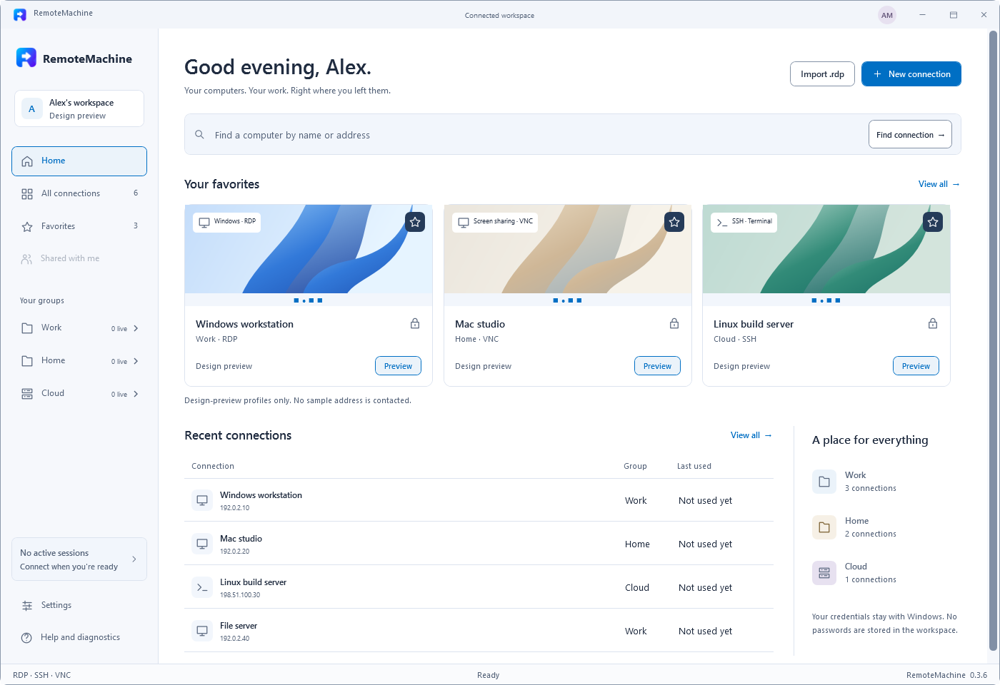
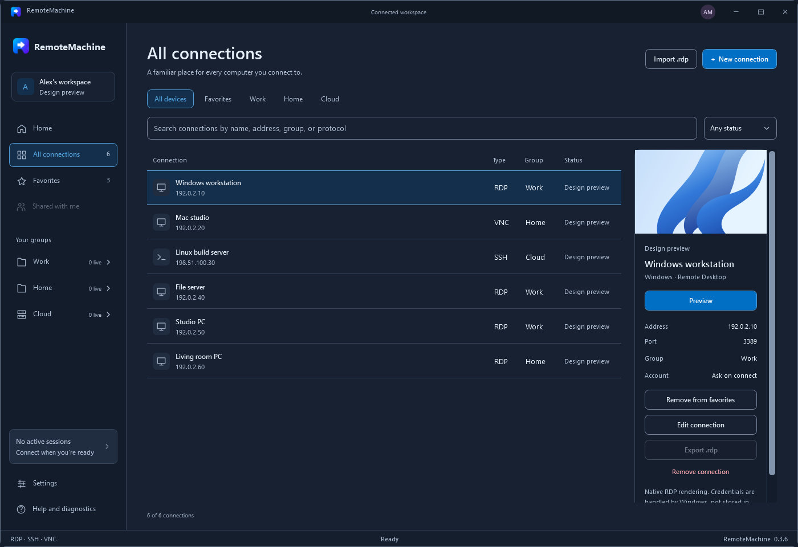
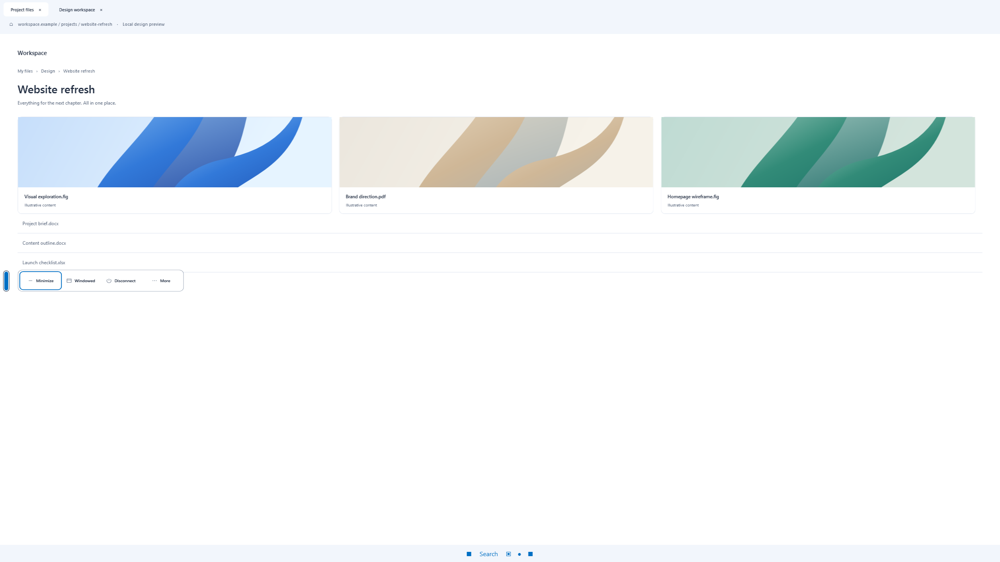
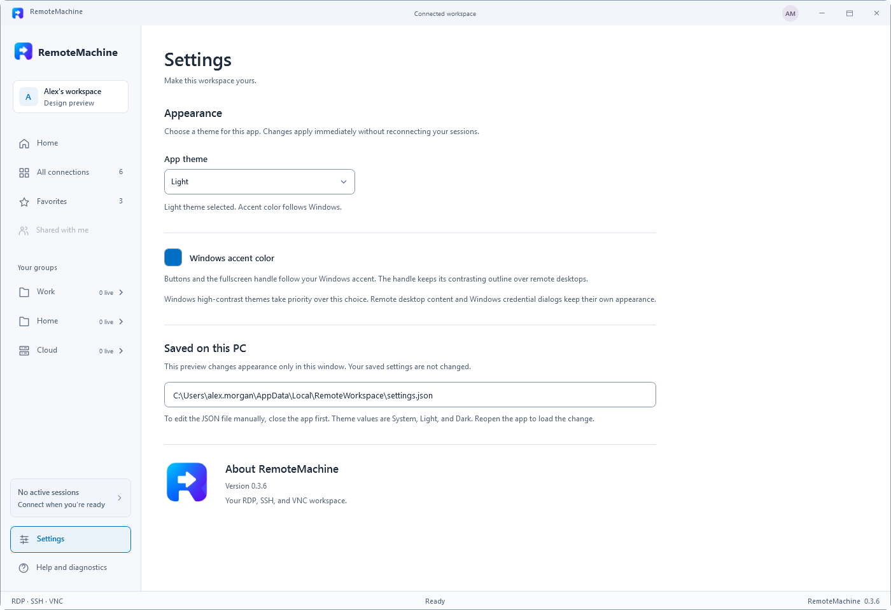

# RemoteMachine

**Windows. Mac. Linux. One workspace.**

A native Windows app for organizing remote computers and working across **RDP, SSH, and VNC**. Keep your sessions together, switch between machines, and use fullscreen without a fixed connection bar covering your work.

RemoteMachine runs on **Windows**. It connects to remote operating systems through the protocols they support; it is a client, not a remote-access server.



*Actual app UI in design-preview mode. All accounts, computers, and addresses in these screenshots are fictional; the preview does not connect to them.*

## Why RemoteMachine?

- **Fullscreen without the fixed bar.** A movable edge handle reveals Minimize, Windowed, Disconnect, and session controls. Move it to any edge or explicitly hide it.
- **One place for different machines.** Native Microsoft RDP, embedded OpenSSH terminals, and embedded VNC for macOS Screen Sharing.
- **Switch without starting over.** Expand Work, Home, or Cloud to select an existing live session. Switching retains the viewer and connection.
- **Fit to your workspace.** Expand a session inside the app or enter fullscreen. VNC keeps the complete desktop proportional, without stretching or cropping.
- **Make it yours.** System, Light, and Dark themes; Windows accent colors; and Windows high-contrast support.
- **Local profiles.** Favorites, groups, search, standard-PC `.rdp` import/export, and per-connection VNC scroll speed from 1x to 8x.

## Screenshots

### Connection library in dark mode



### Unobstructed fullscreen controls



*The desktop shown here is an explicitly labeled illustration, not a live remote computer. The handle and controls are the app's actual native UI.*

### Appearance settings



*The settings path shown is fictional. Preview changes do not alter saved preferences.*

## Supported connections

| Remote machine | Protocol | Setup on the remote machine |
| --- | --- | --- |
| Windows PC | RDP | Enable Remote Desktop on an edition that supports hosting it, and authorize your account. Windows Home does not normally host RDP. |
| Mac | VNC / Screen Sharing | Enable built-in **System Settings > General > Sharing > Screen Sharing** and allow your Mac account. No additional Mac software is needed for this path. |
| Linux or another SSH host | SSH | Enable an SSH server and configure your account or key. This opens a terminal, not a graphical desktop. |
| Compatible graphical desktop | RDP or VNC | Configure a compatible server. Support depends on its protocol and authentication settings; this app does not install the server. |

**VNC security:** the current VNC screen/input transport is **not encrypted**. Use a trusted network, VPN, or an independently established SSH tunnel. Never expose port 5900 directly to the internet. RemoteMachine does not create VNC tunnels automatically, and Apple's proprietary high-performance screen-sharing mode is not supported.

## Build and run

Current version: **0.3.6**. MSIX packaging is available; Microsoft Store publication is pending.

### Requirements

- **Windows 11**, x64 or ARM64.
- **[.NET 10 SDK](https://dotnet.microsoft.com/download/dotnet/10.0)** to build.
- The installed Microsoft Remote Desktop ActiveX component for RDP.
- **[Microsoft Edge WebView2 Runtime](https://developer.microsoft.com/microsoft-edge/webview2/)** for SSH and VNC.
- The Windows **OpenSSH Client** optional feature for SSH.
- Windows PowerShell 5.1 for generating the RDP interop bindings; the build script invokes it when needed.

```powershell
git clone https://github.com/asthanarht/RemoteMachine.git
Set-Location RemoteMachine

# Generates local RDP bindings, runs console checks, and publishes
# for the current machine's x64 or ARM64 architecture.
.\Build.ps1
.\Run.ps1
```

To build for a specific architecture:

```powershell
.\Build.ps1 -Runtime win-x64
.\Build.ps1 -Runtime win-arm64
```

Output is written to `artifacts\<runtime>\RemoteMachine.exe`. Keep the **entire published folder** together. These builds are framework-dependent: another PC also needs the matching **.NET 10 Desktop Runtime**.

Development and native validation have been performed on ARM64. An x64 build option exists, but equivalent native x64 validation is still needed.

The source solution and namespaces retain the earlier `RemoteHub` name for now. The app, executable, and product metadata use **RemoteMachine**.

## First connection

1. Choose **New connection** and select **RDP**, **SSH**, or **VNC**.
2. Enter the hostname or IP, port, group, and optional account details. Save the profile.
3. Select **Connect** and complete the protocol's sign-in prompts.

For a Mac, use its local account credentials when requested, not your Apple ID password. For SSH, verify a new host's fingerprint through a trusted source before accepting it.

Once connected, use **Fit to window** for a larger in-app view or **Focus full screen** for the entire display.

| Fullscreen action | Control |
| --- | --- |
| Show session controls | Click the movable edge handle or press `Ctrl+Alt+Space` |
| Return to the manager | Select **Windowed** or press `Ctrl+Alt+Home` |
| Move the handle | Drag it to another position or edge |
| Hide the handle | Enable the explicit invisible-mode setting; recovery shortcuts must be available |

Windows system shortcuts remain local so recovery and `Alt+Tab` stay available.

## Data and privacy

Connection profiles and appearance preferences are stored locally under `%LOCALAPPDATA%\RemoteWorkspace`. This compatibility directory is intentionally unchanged by the rename.

The app does not save passwords in its profiles. Windows handles RDP authentication, OpenSSH handles SSH authentication, and VNC credentials are requested per connection. Local diagnostic logs record events and timings, not remote screen contents or terminal transcripts. There is no app telemetry or background scanning for hosts.

See the [technical guide](docs/guide.md#local-data-and-credentials) for storage locations, credential behavior, redirection settings, and protocol security limitations.

## Scope and known limitations

This is an early version, not a complete replacement for every managed remote-access product.

- Azure Dev Box / Windows App managed workspaces, RDP gateways, RemoteApp, shared/team workspaces, SFTP UI, and multi-monitor spanning are not implemented.
- SSH support is an embedded shell, not a Linux desktop-sharing implementation.
- VNC does not include Windows/Mac clipboard synchronization, file transfer, automatic SSH tunneling, or TLS/VeNCrypt-only servers.
- A reported issue where the Mac fullscreen pointer can remain a hand is still under investigation.
- Synthetic client-side performance checks do not establish live Mac latency or performance parity with `mstsc`.

## Development

After running `Build.ps1` once to generate local RDP bindings:

```powershell
dotnet run --project .\tests\RemoteHub.Tests\RemoteHub.Tests.csproj --configuration Release

# Isolated native fixtures. Choose the architecture you built.
.\tools\Smoke-Test.ps1 -Executable .\artifacts\win-arm64\RemoteMachine.exe

# Fictional UI preview; no sample host is contacted.
.\Run.ps1 -DesignPreview
```

The native checks open local fixture windows. Avoid interacting with them during execution: physical pointer movement can interfere with exact VNC input assertions. The separate `-Interactive` smoke-test mode deliberately moves the pointer and sends hotkeys; run it only when you intend that behavior.

To regenerate the README screenshots from the actual app's fictional preview:

```powershell
dotnet run --project .\tools\CaptureScreenshots\CaptureScreenshots.csproj --configuration Release -- --design-preview .\docs\screenshots
```

The capture tool never captures the Windows desktop or another app. It renders only its own preview window and owned controls, substitutes a fictional settings path, and closes when finished.

For architecture, protocol details, testing boundaries, and implementation history, see the [technical guide](docs/guide.md).

### Microsoft Store package

```powershell
.\Build-Store.ps1
```

This restores pinned Windows SDK packaging tools and builds self-contained x64 and ARM64 MSIX packages plus a bundle under `artifacts\store\<version>`. It uses the Store-assigned `Asthanarht.RemoteMachine` identity, preserves the supplied icon, and excludes development self-test implementations and command-line preview/test modes from Store builds. It does not modify the installed desktop app or its data.

The output is unsigned for submission to Microsoft Store, which handles production signing. It is not a signed sideload installer. Packaged installation, dependencies, and Store certification must still be verified; producing the bundle does not mean the app is published.

See the [privacy policy](docs/privacy.md) for local data handling and connection-security details.

## Third-party components

RemoteMachine uses WebView2, xterm.js, and noVNC. Their notices and applicable licenses are retained alongside the components. The modified noVNC source and change record are included under `src\RemoteHub\VncAssets`; preserve them when redistributing the app.

The Microsoft RDP implementation comes from Windows and is **not** bundled. The build generates managed interop definitions from the locally installed component.

## Feedback

[Open an issue](https://github.com/asthanarht/RemoteMachine/issues) with your app version, Windows version, architecture, protocol, and reproduction steps. Redact hostnames, IPs, usernames, and private screen content; never include passwords, private keys, or access tokens.
